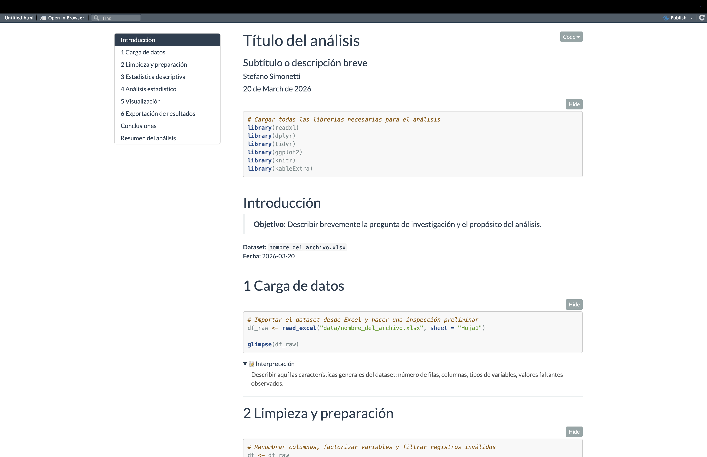

# 📊 CodeSummary

> **A general-purpose RMarkdown template for structured, reproducible data analysis.**  
> Load → Clean → Analyze → Visualize → Export — all in one polished document.

<br>

[](LICENSE)


---

<div align="center">
  <a href="https://dotstefano.github.io/Code_summary/">
    
  </a>
  <br/>
  <sub>Click to open the live interactive document</sub>
</div>

---

## ✨ What is this?

`CodeSummary` is a ready-to-use **RMarkdown template** designed to bring structure and clarity to your data analysis workflow. Instead of starting from a blank `.Rmd` every time, this template gives you a clean, consistent scaffold with all the sections you need — from data loading to final export.

Each analysis chunk comes with a **collapsible interpretation block**, so you can annotate findings inline without cluttering the code. A final summary section ties everything together.

---

## 🗂️ Template Structure

```
📄 Code_summary.Rmd
│
├── 📥  1. Setup & Libraries
├── 📂  2. Data Loading
├── 🧹  3. Data Cleaning
├── 📊  4. Descriptive Statistics
├── 🔬  5. Statistical Tests
├── 📈  6. Visualization
├── 📤  7. Export (Excel / CSV)
└── 📝  8. Final Summary
```

Each section includes:
- Annotated, ready-to-modify code
- A `<details>` collapsible block for interpretations
- Consistent chunk naming for easy navigation

---

## 🚀 Quick Start

**1. Install the package**

```r
remotes::install_github("DotStefano/Code_summary")
```

**2. Open the template in RStudio**

File → New File → R Markdown → From Template → **Code Summary**

**3. Or download directly**

```r
download.file(
  url = "https://raw.githubusercontent.com/DotStefano/Code_summary/main/inst/rmarkdown/templates/doctorado/skeleton/skeleton.Rmd",
  destfile = "my_analysis.Rmd"
)
```

**4. Render**

```r
rmarkdown::render("my_analysis.Rmd")
```

---

## 📦 Dependencies

```r
install.packages(c(
  "tidyverse",   # Data wrangling and visualization
  "openxlsx",    # Excel export
  "knitr",       # Report rendering
  "kableExtra"   # Table formatting
))
```

---

## 💡 Key Features

| Feature | Description |
|---|---|
| 🔁 **Reproducible** | Self-contained structure, clear session info block |
| 💬 **Annotatable** | Collapsible `<details>` blocks per chunk for inline notes |
| 📤 **Export-ready** | Built-in multi-sheet Excel export section |
| 🔬 **Analysis-focused** | Covers the full pipeline from raw data to final output |
| 🧩 **Modular** | Each section is independent — add, remove, or reorder freely |

---

## 📁 Repository Structure

```
Code_summary/
├── assets/
│   └── CODE_SUMMARY.png    # Preview image
├── inst/rmarkdown/templates/doctorado/
│   └── skeleton/skeleton.Rmd  # The main template
├── index.html              # Live preview (GitHub Pages)
├── DESCRIPTION
├── LICENSE
└── README.md
```

---

## 🤝 Contributing

Suggestions and improvements are welcome. Feel free to open an issue or submit a pull request.

---

## 📄 License

This project is licensed under the [MIT License](LICENSE).

---

<div align="center">
  <sub>Built for reproducible research · Made with ❤️ and R</sub>
</div>
